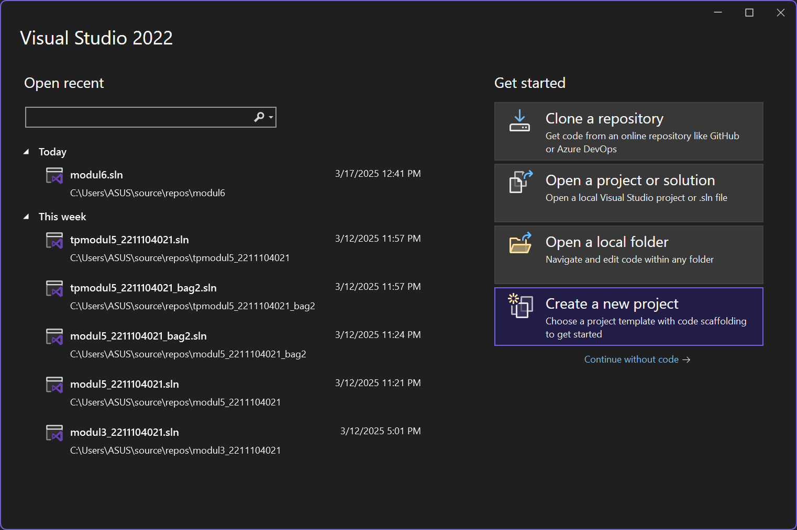
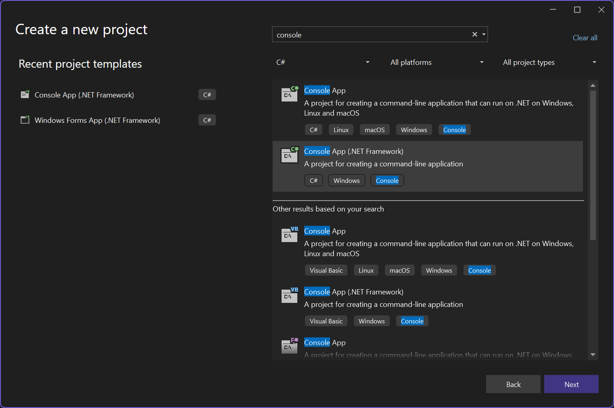
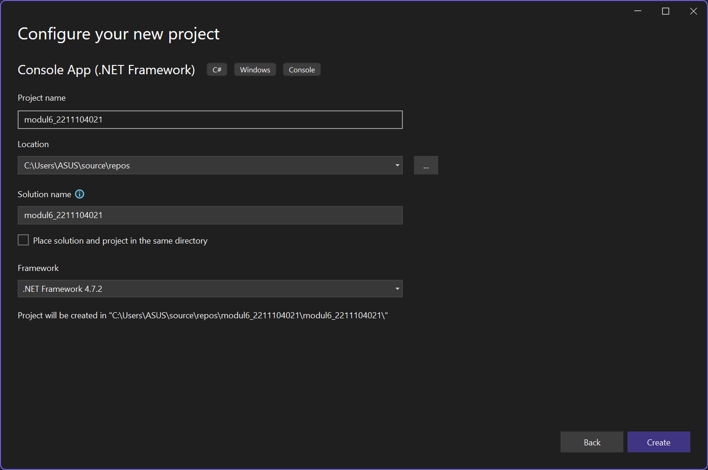
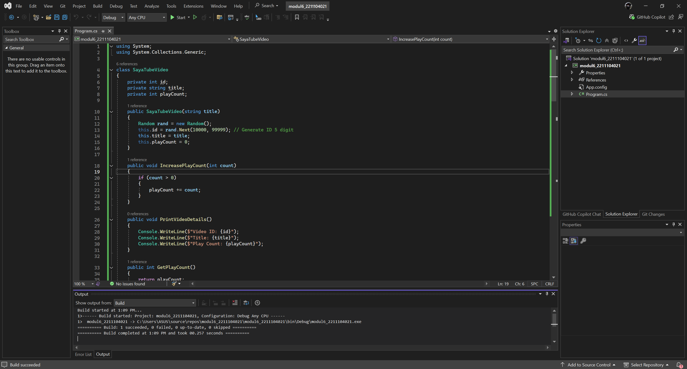
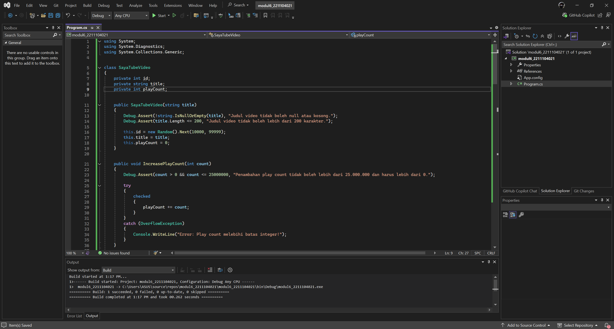
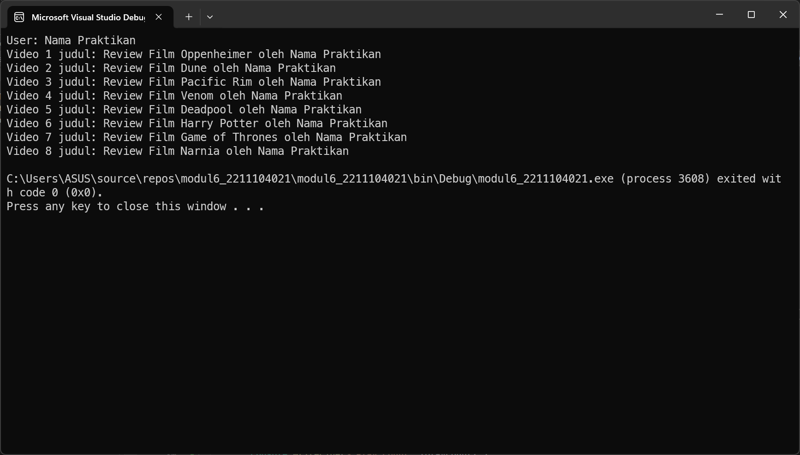
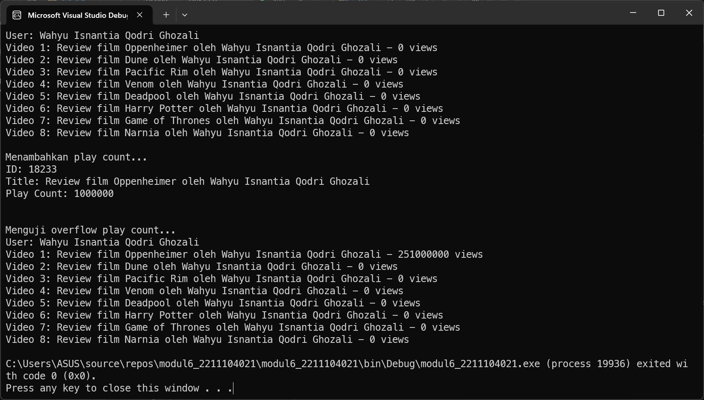

<div align="center">
JURNAL <br>
KONSTRUKSI PERANGKAT LUNAK <br>
<br>
MODUL VI <br>
<!-- JUDUL -->
 <br>


<br>

Disusun Oleh: <br>
Muhamad Luthfi Hamdani/2211104020 <br>
SE-06-01 <br>

<br>

Asisten Praktikum : <br>
Naufal El Kamil Aditya Pratama Rahman <br>
Imelda Alfina Palupi Dewi <br>

<br>

Dosen Pengampu : <br>
Yudha Islami Sulistya, S.Kom., M.Cs <br>

<br>

PROGRAM STUDI S1 REKAYASSA PERANGKAT LUNAK <br>
FAKULTAS INFORMATIKA <br> 
TELKOM UNIVERSITY PURWOKERTO <br>

</div>

## 1. Membuat Projek Baru




## 2. Implementasi Kode

### Implementasi Kode Awal


#### Source Code:
```
using System;
using System.Collections.Generic;

class SayaTubeVideo
{
    private int id;
    private string title;
    private int playCount;

    public SayaTubeVideo(string title)
    {
        Random rand = new Random();
        this.id = rand.Next(10000, 99999); // Generate ID 5 digit
        this.title = title;
        this.playCount = 0;
    }

    public void IncreasePlayCount(int count)
    {
        if (count > 0)
        {
            playCount += count;
        }
    }

    public void PrintVideoDetails()
    {
        Console.WriteLine($"Video ID: {id}");
        Console.WriteLine($"Title: {title}");
        Console.WriteLine($"Play Count: {playCount}");
    }

    public int GetPlayCount()
    {
        return playCount;
    }

    public string GetTitle()
    {
        return title;
    }
}

class SayaTubeUser
{
    private int id;
    private List<SayaTubeVideo> uploadedVideos;
    public string Username { get; private set; }

    public SayaTubeUser(string username)
    {
        Random rand = new Random();
        this.id = rand.Next(10000, 99999); // Generate ID 5 digit
        this.Username = username;
        this.uploadedVideos = new List<SayaTubeVideo>();
    }

    public void AddVideo(SayaTubeVideo video)
    {
        uploadedVideos.Add(video);
    }

    public int GetTotalVideoPlayCount()
    {
        int total = 0;
        foreach (var video in uploadedVideos)
        {
            total += video.GetPlayCount();
        }
        return total;
    }

    public void PrintAllVideoPlaycount()
    {
        Console.WriteLine($"User: {Username}");
        int index = 1;
        foreach (var video in uploadedVideos)
        {
            Console.WriteLine($"Video {index} judul: {video.GetTitle()}");
            index++;
        }
    }
}

class Program
{
    static void Main(string[] args)
    {
        SayaTubeUser user = new SayaTubeUser("Nama Praktikan");

        // Judul film yang diperbarui
        string[] filmTitles = {
            "Oppenheimer", "Dune", "Pacific Rim",
            "Venom", "Deadpool", "Harry Potter",
            "Game of Thrones", "Narnia"
        };

        foreach (var title in filmTitles)
        {
            SayaTubeVideo video = new SayaTubeVideo($"Review Film {title} oleh Nama Praktikan");
            video.IncreasePlayCount(100); // Simulasi jumlah views
            user.AddVideo(video);
        }

        // Cetak detail semua video user
        user.PrintAllVideoPlaycount();
    }
}
```

### Implementasi Design By Contract


#### Source Code:
```
using System;
using System.Diagnostics;
using System.Collections.Generic;

class SayaTubeVideo
{
    private int id;
    private string title;
    private int playCount;

    public SayaTubeVideo(string title)
    {
        Debug.Assert(!string.IsNullOrEmpty(title), "Judul video tidak boleh null atau kosong.");
        Debug.Assert(title.Length <= 200, "Judul video tidak boleh lebih dari 200 karakter.");

        this.id = new Random().Next(10000, 99999);
        this.title = title;
        this.playCount = 0;
    }

    public void IncreasePlayCount(int count)
    {
        Debug.Assert(count > 0 && count <= 25000000, "Penambahan play count tidak boleh lebih dari 25.000.000 dan harus lebih dari 0.");

        try
        {
            checked
            {
                playCount += count;
            }
        }
        catch (OverflowException)
        {
            Console.WriteLine("Error: Play count melebihi batas integer!");
        }
    }

    public void PrintVideoDetails()
    {
        Console.WriteLine($"ID: {id}");
        Console.WriteLine($"Title: {title}");
        Console.WriteLine($"Play Count: {playCount}");
        Console.WriteLine();
    }

    public int GetPlayCount()
    {
        return playCount;
    }

    public string GetTitle()
    {
        return title;
    }
}

class SayaTubeUser
{
    private int id;
    private string username;
    private List<SayaTubeVideo> uploadedVideos;

    public SayaTubeUser(string username)
    {
        Debug.Assert(!string.IsNullOrEmpty(username), "Username tidak boleh null atau kosong.");
        Debug.Assert(username.Length <= 100, "Username tidak boleh lebih dari 100 karakter.");

        this.id = new Random().Next(10000, 99999);
        this.username = username;
        this.uploadedVideos = new List<SayaTubeVideo>();
    }

    public void AddVideo(SayaTubeVideo video)
    {
        Debug.Assert(video != null, "Video tidak boleh null.");
        Debug.Assert(video.GetPlayCount() < int.MaxValue, "Play count video tidak boleh melebihi batas integer.");

        uploadedVideos.Add(video);
    }

    public void PrintAllVideoPlaycount()
    {
        Console.WriteLine($"User: {username}");

        int maxVideosToPrint = Math.Min(uploadedVideos.Count, 8);
        for (int i = 0; i < maxVideosToPrint; i++)
        {
            Console.WriteLine($"Video {i + 1}: {uploadedVideos[i].GetTitle()} - {uploadedVideos[i].GetPlayCount()} views");
        }
    }

    public List<SayaTubeVideo> GetUploadedVideos()
    {
        return uploadedVideos;
    }
}

class Program
{
    static void Main(string[] args)
    {
        SayaTubeUser user = new SayaTubeUser("Wahyu Isnantia Qodri Ghozali");

        List<string> videoTitles = new List<string>
        {
            "Oppenheimer",
            "Dune",
            "Pacific Rim",
            "Venom",
            "Deadpool",
            "Harry Potter",
            "Game of Thrones",
            "Narnia"
        };

        foreach (var title in videoTitles)
        {
            SayaTubeVideo video = new SayaTubeVideo($"Review film {title} oleh Wahyu Isnantia Qodri Ghozali");
            user.AddVideo(video);
        }

        user.PrintAllVideoPlaycount();

        // Mengakses video melalui method GetUploadedVideos()
        var videos = user.GetUploadedVideos();

        // Test valid play count increment
        Console.WriteLine("\nMenambahkan play count...");
        videos[0].IncreasePlayCount(1000000);
        videos[0].PrintVideoDetails();

        // Test overflow exception
        Console.WriteLine("\nMenguji overflow play count...");
        for (int i = 0; i < 10; i++)
        {
            videos[0].IncreasePlayCount(25000000);
        }

        user.PrintAllVideoPlaycount();
    }
}

```

## 3. Output
### Output Kode Awal:


### Output Implementasi Design By Contract:


### Penjelasan
Di file `Program.cs` akan dibuat dua class utama, yaitu `SayaTubeVideo` untuk merepresentasikan video dengan atribut `title`, `id`, dan `playCount`, serta `SayaTubeUser` untuk merepresentasikan pengguna yang memiliki daftar video yang diunggah. Di dalam class `SayaTubeVideo` akan ada metode `IncreasePlayCount()` untuk menambah jumlah tayangan video dengan batas maksimal 25.000.000 per kali pemanggilan, serta mekanisme pengecekan overflow menggunakan `checked`. Di dalam class `SayaTubeUser` akan ada metode `AddVideo()` untuk menambahkan video ke daftar pengguna dengan validasi bahwa video tidak boleh null dan jumlah tayangannya belum mencapai batas integer maksimum. Di dalam `Main()` akan dibuat objek `SayaTubeUser` dengan beberapa video seperti *Oppenheimer*, *Dune*, dan *Venom*, lalu semua video akan ditampilkan menggunakan `PrintAllVideoPlaycount()`, serta diuji penambahan play count dan overflow dengan pengulangan `IncreasePlayCount()`.
