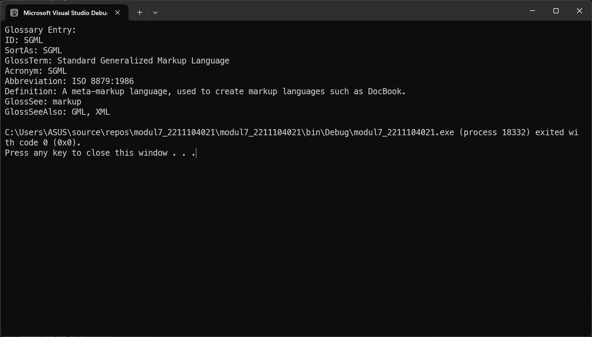

<div align="center">
JURNAL <br>
KONSTRUKSI PERANGKAT LUNAK <br>
<br>
MODUL VII <br>
<!-- JUDUL -->
 <br>


<br>

Disusun Oleh: <br>
Muhamad Luthfi Hamdani/2211104020 <br>
SE-06-01 <br>

<br>

Asisten Praktikum : <br>
Naufal El Kamil Aditya Pratama Rahman <br>
Imelda Alfina Palupi Dewi <br>

<br>

Dosen Pengampu : <br>
Yudha Islami Sulistya, S.Kom., M.Cs <br>

<br>

PROGRAM STUDI S1 REKAYASSA PERANGKAT LUNAK <br>
FAKULTAS INFORMATIKA <br> 
TELKOM UNIVERSITY PURWOKERTO <br>

</div>

## 1. Membuat Projek Baru


### Menambahkan NuGet Package


## 2. Implementasi Kode
### JSON Deserialization 1:


#### Source Code:
```
using System;
using System.IO;
using Newtonsoft.Json;

class DataMahasiswa2211104021
{
    public class Address
    {
        public string StreetAddress { get; set; }
        public string City { get; set; }
        public string State { get; set; }
    }

    public class Course
    {
        public string Code { get; set; }
        public string Name { get; set; }
    }

    public class Mahasiswa
    {
        public string FirstName { get; set; }
        public string LastName { get; set; }
        public string Gender { get; set; }
        public int Age { get; set; }
        public Address Address { get; set; }
        public Course[] Courses { get; set; }
    }

    public static void ReadJSON()
    {
        string filePath = "jurnal7_1_2211104021.json";

        if (File.Exists(filePath))
        {
            string json = File.ReadAllText(filePath);
            Mahasiswa mahasiswa = JsonConvert.DeserializeObject<Mahasiswa>(json);

            Console.WriteLine("Mahasiswa Info:");
            Console.WriteLine($"Nama: {mahasiswa.FirstName} {mahasiswa.LastName}");
            Console.WriteLine($"Gender: {mahasiswa.Gender}");
            Console.WriteLine($"Usia: {mahasiswa.Age}");
            Console.WriteLine($"Alamat: {mahasiswa.Address.StreetAddress}, {mahasiswa.Address.City}, {mahasiswa.Address.State}");
            Console.WriteLine("Mata Kuliah:");
            foreach (var course in mahasiswa.Courses)
            {
                Console.WriteLine($"  - {course.Code}: {course.Name}");
            }
        }
        else
        {
            Console.WriteLine("File JSON tidak ditemukan.");
        }
    }

    static void Main()
    {
        ReadJSON();
    }
}
```
#### Penjelasan
Di file *Program.cs* akan membaca data mahasiswa dari file JSON bernama *jurnal7_1_2211104021.json* menggunakan library *Newtonsoft.Json* untuk deserialisasi. Kelas `Mahasiswa` memiliki atribut seperti nama, gender, usia, alamat (`Address`), dan daftar mata kuliah (`Course`). Metode `ReadJSON()` akan mengecek apakah file JSON tersedia, lalu membacanya dan mengonversinya menjadi objek `Mahasiswa`, kemudian menampilkan informasi mahasiswa tersebut di konsol. Jika file tidak ditemukan, akan muncul pesan kesalahan. Metode `Main()` hanya memanggil `ReadJSON()` untuk menjalankan proses pembacaan data.

### JSON Deserialization 2:


#### Source Code:
```
using System;
using System.Collections.Generic;
using System.IO;
using Newtonsoft.Json;

class TeamMember
{
    public string firstName { get; set; }
    public string lastName { get; set; }
    public string gender { get; set; }
    public int age { get; set; }
    public string nim { get; set; }
}

class TeamData
{
    public List<TeamMember> members { get; set; }
}

class TeamMembers2211104021
{
    public static void ReadJSON()
    {
        string filePath = "jurnal7_2_2211104021.json";

        if (File.Exists(filePath))
        {
            string jsonContent = File.ReadAllText(filePath);
            TeamData team = JsonConvert.DeserializeObject<TeamData>(jsonContent);

            Console.WriteLine("Team member list:");
            foreach (var member in team.members)
            {
                Console.WriteLine($"{member.nim} {member.firstName} {member.lastName} ({member.age} {member.gender})");
            }
        }
        else
        {
            Console.WriteLine("File JSON tidak ditemukan.");
        }
    }

    static void Main()
    {
        ReadJSON();
    }
}
```
#### Penjelasan
Di file *Program.cs* ini akan membaca daftar anggota tim dari file JSON bernama *jurnal7_2_2211104021.json* menggunakan library *Newtonsoft.Json* untuk deserialisasi. Kelas `TeamMember` merepresentasikan anggota tim dengan atribut seperti nama, gender, usia, dan NIM, sedangkan kelas `TeamData` berisi daftar anggota tim dalam bentuk *List*. Metode `ReadJSON()` akan mengecek keberadaan file JSON, membacanya, lalu mengonversinya menjadi objek `TeamData`, kemudian menampilkan daftar anggota tim di konsol. Jika file tidak ditemukan, akan muncul pesan kesalahan. Metode `Main()` hanya memanggil `ReadJSON()` untuk menjalankan proses pembacaan data.

### JSON Deserialization 3:


#### Source Code:
```
using System;
using System.IO;
using Newtonsoft.Json;

public class GlossaryEntry
{
    public string ID { get; set; }
    public string SortAs { get; set; }
    public string GlossTerm { get; set; }
    public string Acronym { get; set; }
    public string Abbrev { get; set; }
    public GlossDef GlossDef { get; set; }
    public string GlossSee { get; set; }
}

public class GlossDef
{
    public string Para { get; set; }
    public string[] GlossSeeAlso { get; set; }
}

public class GlossList
{
    public GlossaryEntry GlossEntry { get; set; }
}

public class GlossDiv
{
    public string Title { get; set; }
    public GlossList GlossList { get; set; }
}

public class Glossary
{
    public string Title { get; set; }
    public GlossDiv GlossDiv { get; set; }
}

public class RootObject
{
    public Glossary Glossary { get; set; }
}

public class GlossaryItem2211104021
{
    public static void ReadJSON()
    {
        string jsonPath = "jurnal7_3_2211104021.json";
        string jsonString = File.ReadAllText(jsonPath);

        RootObject glossaryData = JsonConvert.DeserializeObject<RootObject>(jsonString);

        GlossaryEntry entry = glossaryData.Glossary.GlossDiv.GlossList.GlossEntry;

        Console.WriteLine("Glossary Entry:");
        Console.WriteLine($"ID: {entry.ID}");
        Console.WriteLine($"SortAs: {entry.SortAs}");
        Console.WriteLine($"GlossTerm: {entry.GlossTerm}");
        Console.WriteLine($"Acronym: {entry.Acronym}");
        Console.WriteLine($"Abbreviation: {entry.Abbrev}");
        Console.WriteLine($"Definition: {entry.GlossDef.Para}");
        Console.WriteLine($"GlossSee: {entry.GlossSee}");
        Console.WriteLine("GlossSeeAlso: " + string.Join(", ", entry.GlossDef.GlossSeeAlso));
    }
}

public class Program
{
    public static void Main()
    {
        GlossaryItem2211104021.ReadJSON();
    }
}
```
#### Penjelasan
Di file *Program.cs* ini akan membaca dan menampilkan data entri glosarium dari file JSON bernama *jurnal7_3_2211104021.json* menggunakan library *Newtonsoft.Json* untuk deserialisasi. Kelas `GlossaryEntry` merepresentasikan entri glosarium dengan atribut seperti ID, istilah, akronim, dan definisi, sementara kelas lain seperti `GlossDef`, `GlossList`, `GlossDiv`, dan `Glossary` digunakan untuk merepresentasikan struktur JSON secara hierarkis. Metode `ReadJSON()` akan membaca file JSON, mengonversinya menjadi objek `RootObject`, lalu mengambil entri glosarium dari dalamnya dan menampilkannya di konsol. Jika file tidak ditemukan, program akan gagal membaca datanya. Metode `Main()` hanya memanggil `ReadJSON()` untuk menjalankan proses pembacaan data.

## 3. Output
### Output JSON Deserialization 1:


### Output JSON Deserialization 2:


### Output JSON Deserialization 3:

