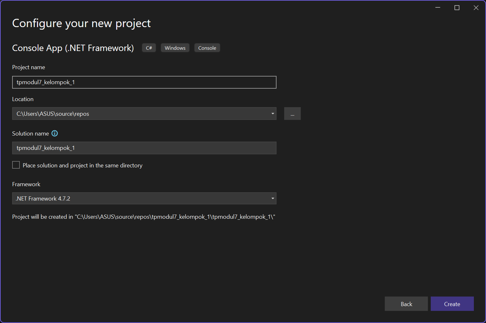
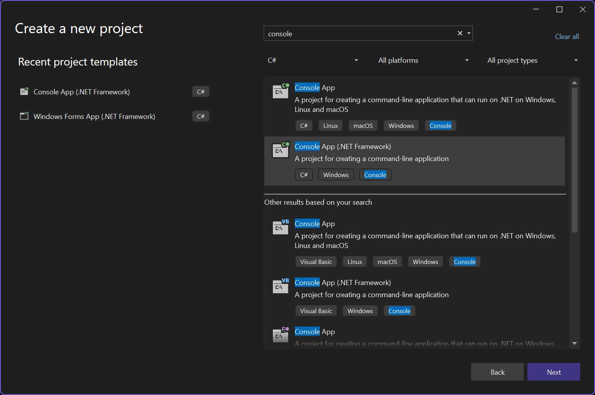
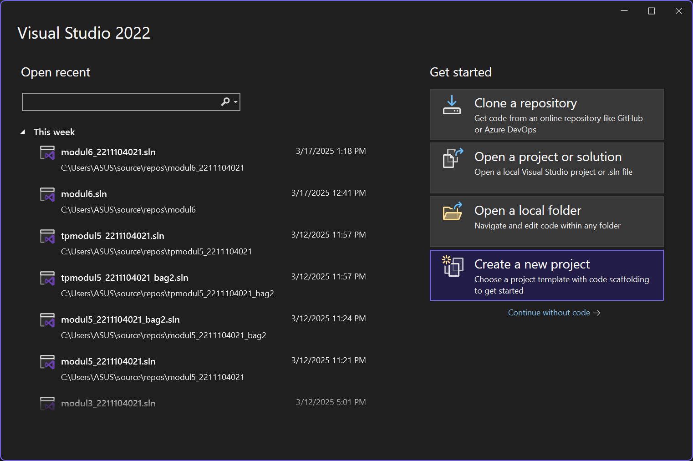
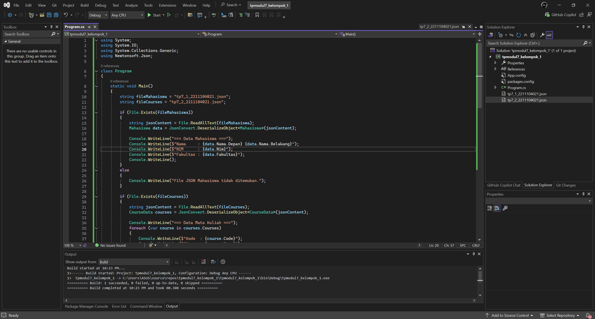
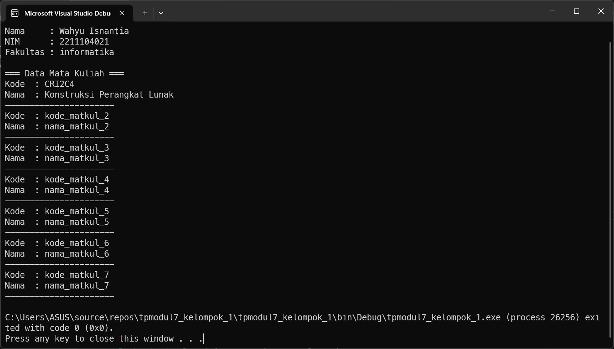

<div align="center">
TUGAS PENDAHULUAN <br>
KONSTRUKSI PERANGKAT LUNAK <br>
<br>
MODUL VII <br>
<!-- JUDUL -->
 <br>


<br>

Disusun Oleh: <br>
Muhamad Luthfi Hamdani/2211104020 <br>
SE-06-01 <br>

<br>

Asisten Praktikum : <br>
Naufal El Kamil Aditya Pratama Rahman <br>
Imelda Alfina Palupi Dewi <br>

<br>

Dosen Pengampu : <br>
Yudha Islami Sulistya, S.Kom., M.Cs <br>

<br>

PROGRAM STUDI S1 REKAYASSA PERANGKAT LUNAK <br>
FAKULTAS INFORMATIKA <br> 
TELKOM UNIVERSITY PURWOKERTO <br>

</div>

## 1. Membuat Projek Baru




## 2. Implementasi Kode


### Source Code
```
using System;
using System.IO;
using System.Collections.Generic;
using Newtonsoft.Json;

class Program
{
    static void Main()
    {
        string fileMahasiswa = "tp7_1_2211104021.json";
        string fileCourses = "tp7_2_2211104021.json";

        if (File.Exists(fileMahasiswa))
        {
            string jsonContent = File.ReadAllText(fileMahasiswa);
            Mahasiswa data = JsonConvert.DeserializeObject<Mahasiswa>(jsonContent);

            Console.WriteLine("=== Data Mahasiswa ===");
            Console.WriteLine($"Nama     : {data.Nama.Depan} {data.Nama.Belakang}");
            Console.WriteLine($"NIM      : {data.Nim}");
            Console.WriteLine($"Fakultas : {data.Fakultas}");
            Console.WriteLine();
        }
        else
        {
            Console.WriteLine("File JSON Mahasiswa tidak ditemukan.");
        }

        if (File.Exists(fileCourses))
        {
            string jsonContent = File.ReadAllText(fileCourses);
            CourseData courses = JsonConvert.DeserializeObject<CourseData>(jsonContent);

            Console.WriteLine("=== Data Mata Kuliah ===");
            foreach (var course in courses.Courses)
            {
                Console.WriteLine($"Kode  : {course.Code}");
                Console.WriteLine($"Nama  : {course.Name}");
                Console.WriteLine("----------------------");
            }
        }
        else
        {
            Console.WriteLine("File JSON Mata Kuliah tidak ditemukan.");
        }
    }
}

class Mahasiswa
{
    public Nama Nama { get; set; }
    public string Nim { get; set; }
    public string Fakultas { get; set; }
}

class Nama
{
    public string Depan { get; set; }
    public string Belakang { get; set; }
}

class CourseData
{
    public List<Course> Courses { get; set; }
}

class Course
{
    public string Code { get; set; }
    public string Name { get; set; }
}

```

## 3. Output


### Penjelasan
Di file `Program.cs` akan membaca dua file JSON, yaitu `tp7_1_2211104021.json` yang berisi data mahasiswa dan `tp7_2_2211104021.json` yang berisi daftar mata kuliah, lalu menampilkannya di terminal menggunakan kelas `Mahasiswa` untuk data mahasiswa serta `CourseData` dan `Course` untuk daftar mata kuliah, dengan bantuan `Newtonsoft.Json` untuk proses deserialisasi JSON ke objek C#.
