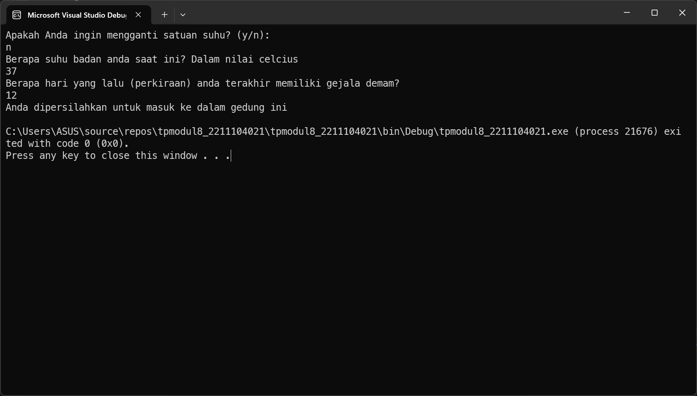

<div align="center">
TUGAS PENDAHULUAN <br>
KONSTRUKSI PERANGKAT LUNAK <br>
<br>
MODUL VIII <br>
<!-- JUDUL -->
 <br>


<br>

Disusun Oleh: <br>
Muhamad Luthfi Hamdani/2211104020 <br>
SE-06-01 <br>

<br>

Asisten Praktikum : <br>
Naufal El Kamil Aditya Pratama Rahman <br>
Imelda Alfina Palupi Dewi <br>

<br>

Dosen Pengampu : <br>
Yudha Islami Sulistya, S.Kom., M.Cs <br>

<br>

PROGRAM STUDI S1 REKAYASSA PERANGKAT LUNAK <br>
FAKULTAS INFORMATIKA <br> 
TELKOM UNIVERSITY PURWOKERTO <br>

</div>

## 1. Membuat Projek Baru


### Menambahkan NuGet Packages


## 2. Implementasi Kode


### Source Code:
```
using System;
using System.IO;
using Newtonsoft.Json;

class CovidConfig
{
    private const string ConfigFile = "covid_config.json";
    public string SatuanSuhu { get; set; } = "celcius";
    public int BatasHariDeman { get; set; } = 14;
    public string PesanDitolak { get; set; } = "Anda tidak diperbolehkan masuk ke dalam gedung ini";
    public string PesanDiterima { get; set; } = "Anda dipersilahkan untuk masuk ke dalam gedung ini";

    public CovidConfig()
    {
        LoadConfig();
    }

    private void LoadConfig()
    {
        if (File.Exists(ConfigFile))
        {
            string json = File.ReadAllText(ConfigFile);
            var config = JsonConvert.DeserializeObject<CovidConfig>(json);
            SatuanSuhu = config.SatuanSuhu;
            BatasHariDeman = config.BatasHariDeman;
            PesanDitolak = config.PesanDitolak;
            PesanDiterima = config.PesanDiterima;
        }
        else
        {
            SaveConfig();
        }
    }

    public void SaveConfig()
    {
        string json = JsonConvert.SerializeObject(this, Formatting.Indented);
        File.WriteAllText(ConfigFile, json);
    }

    public void UbahSatuan()
    {
        SatuanSuhu = SatuanSuhu == "celcius" ? "fahrenheit" : "celcius";
        SaveConfig();
    }
}

class Program
{
    static void Main()
    {
        CovidConfig config = new CovidConfig();
        Console.WriteLine("Apakah Anda ingin mengganti satuan suhu? (y/n): ");
        if (Console.ReadLine().ToLower() == "y")
        {
            config.UbahSatuan();
            Console.WriteLine("Satuan suhu telah diubah menjadi " + config.SatuanSuhu);
        }

        Console.WriteLine($"Berapa suhu badan anda saat ini? Dalam nilai {config.SatuanSuhu}");
        double suhu = Convert.ToDouble(Console.ReadLine());

        Console.WriteLine("Berapa hari yang lalu (perkiraan) anda terakhir memiliki gejala demam?");
        int hariDemam = Convert.ToInt32(Console.ReadLine());

        bool suhuValid = (config.SatuanSuhu == "celcius" && suhu >= 36.5 && suhu <= 37.5) ||
                          (config.SatuanSuhu == "fahrenheit" && suhu >= 97.7 && suhu <= 99.5);

        bool hariValid = hariDemam < config.BatasHariDeman;

        Console.WriteLine(suhuValid && hariValid ? config.PesanDiterima : config.PesanDitolak);
    }
}

```
### Penjelasan
Di kelas `CovidConfig` akan dilakukan pembacaan file konfigurasi `covid_config.json`, jika file tidak ada, maka akan dibuat dengan nilai default. Di method `UbahSatuan` akan dilakukan perubahan satuan suhu antara "celcius" dan "fahrenheit", lalu disimpan kembali ke file. Di `Main` akan ditanyakan apakah pengguna ingin mengganti satuan suhu, kemudian meminta input suhu tubuh dan jumlah hari sejak terakhir demam. Di akhir, program akan mengevaluasi apakah suhu dan jumlah hari sesuai dengan batas konfigurasi untuk menentukan apakah pengguna boleh masuk atau tidak.

## 3. Output
### Output ketika diperbolehkan masuk


### Output ketika tidak diperbolehkan masuk

