<div align="center">
TUGAS PENDAHULUAN <br>
KONSTRUKSI PERANGKAT LUNAK <br>
<br>
MODUL IX <br>
<!-- JUDUL -->
 <br>


<br>

Disusun Oleh: <br>
Muhamad Luthfi Hamdani/2211104020 <br>
SE-06-01 <br>

<br>

Asisten Praktikum : <br>
Naufal El Kamil Aditya Pratama Rahman <br>
Imelda Alfina Palupi Dewi <br>

<br>

Dosen Pengampu : <br>
Yudha Islami Sulistya, S.Kom., M.Cs <br>

<br>

PROGRAM STUDI S1 REKAYASSA PERANGKAT LUNAK <br>
FAKULTAS INFORMATIKA <br> 
TELKOM UNIVERSITY PURWOKERTO <br>

</div>

## 1. Membuat Projek Baru
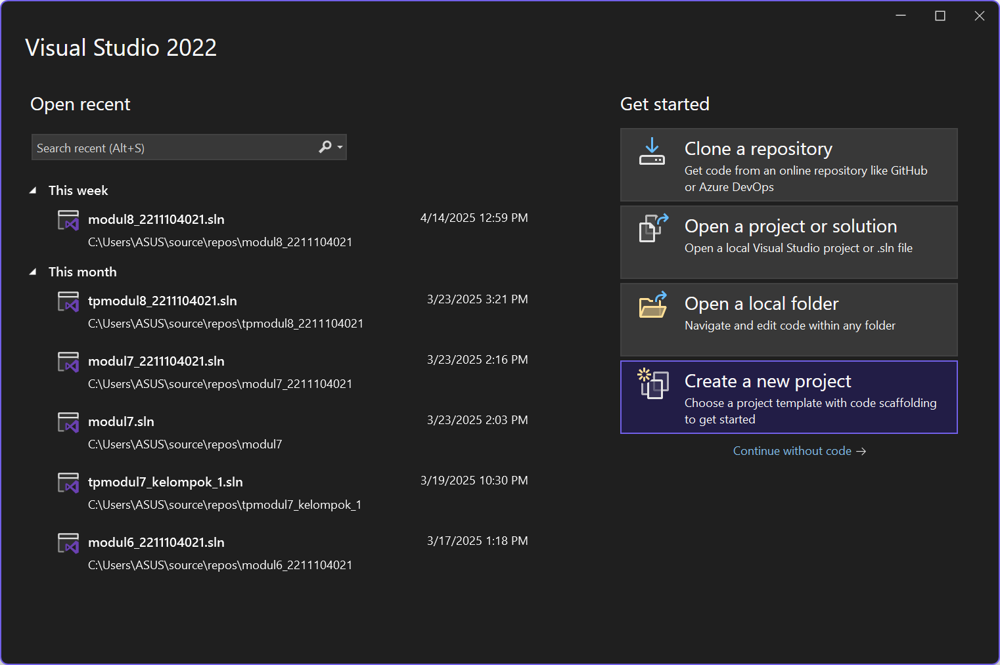
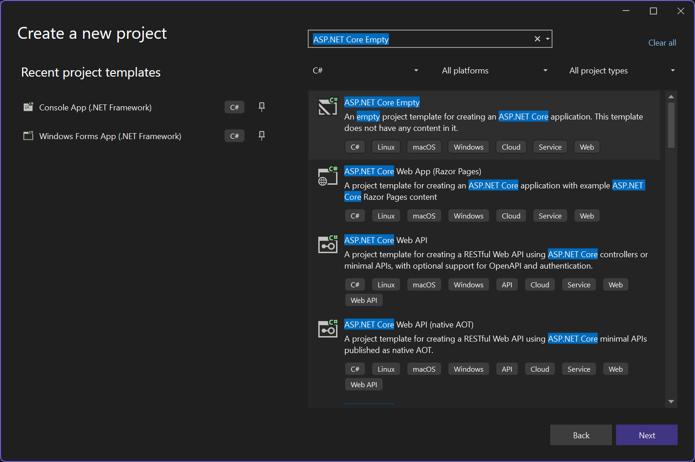
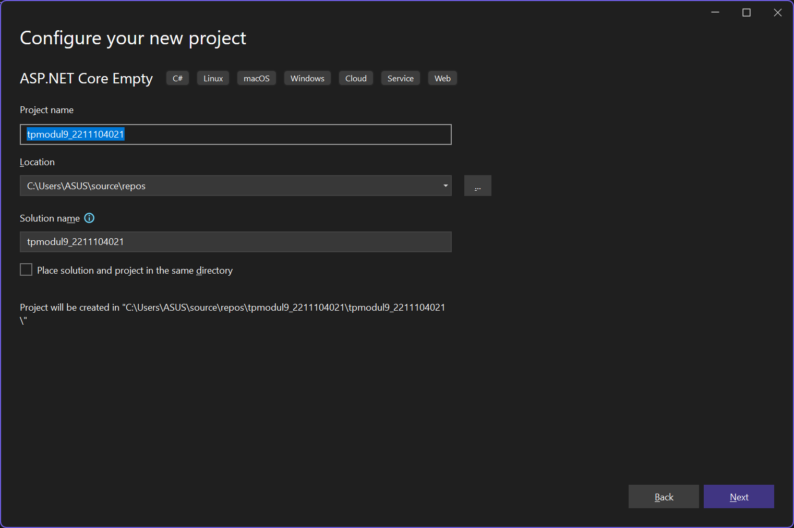
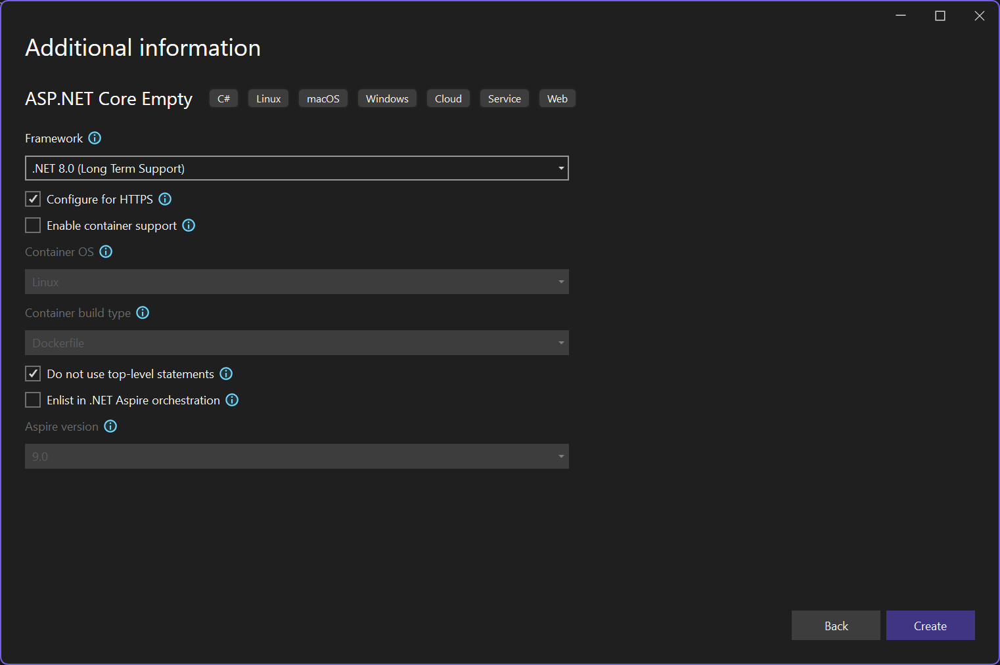
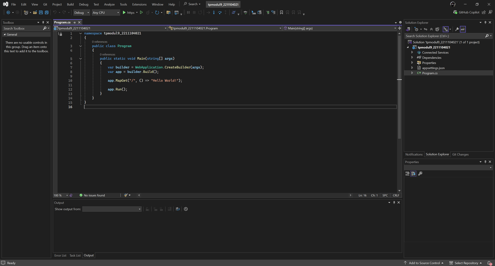

### Menginstall NuGet Packages `Microsoft.EntityFrameworkCore.InMemory`:
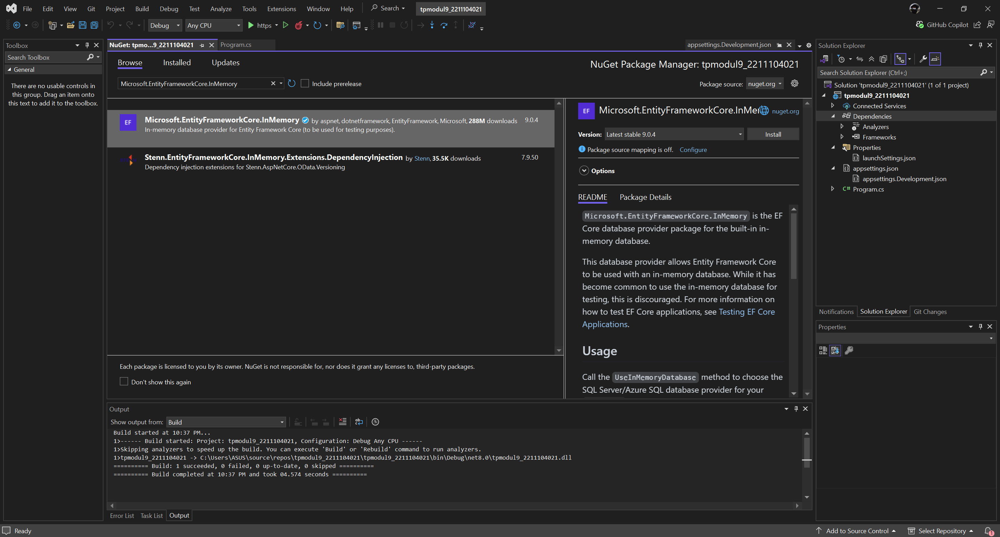

### Jalankan Program, dan tekan yes:
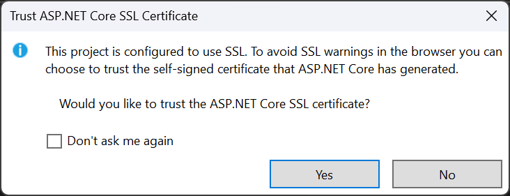
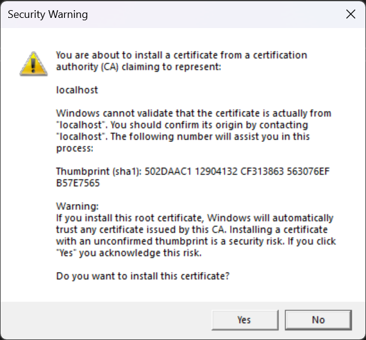
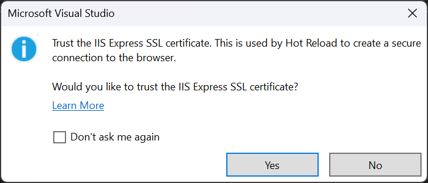

### Buka di Web Browser
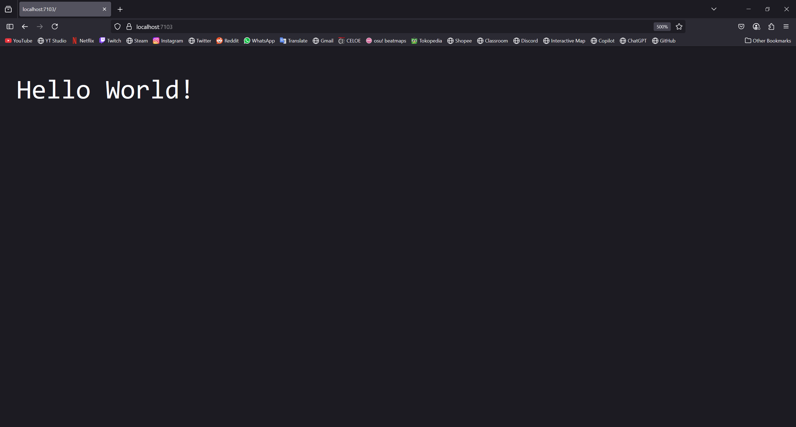

## 2. Implementasi kode
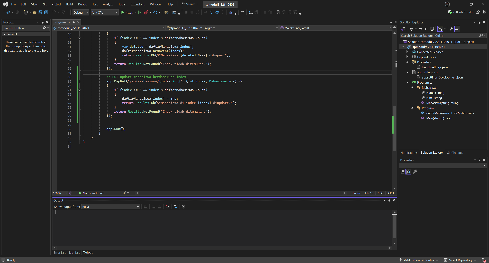

### Source Code:
```
using Microsoft.AspNetCore.Builder;
using Microsoft.AspNetCore.Http;
using Microsoft.Extensions.Hosting;
using System.Collections.Generic;

namespace tpmodul9_2211104021
{
    public class Mahasiswa
    {
        public string Nama { get; set; }
        public string Nim { get; set; }

        public Mahasiswa(string nama, string nim)
        {
            Nama = nama;
            Nim = nim;
        }
    }

    public class Program
    {
        public static List<Mahasiswa> daftarMahasiswa = new List<Mahasiswa>
        {
            new Mahasiswa("Wahyu Isnantia Qodri Ghozali", "2211104021"),
            new Mahasiswa("LeBron James", "1302000001"),
            new Mahasiswa("Stephen Curry", "1302000002")
        };

        public static void Main(string[] args)
        {
            var builder = WebApplication.CreateBuilder(args);
            var app = builder.Build();

            app.MapGet("/", () => "Hello World!");

            // GET semua mahasiswa
            app.MapGet("/api/mahasiswa", () => daftarMahasiswa);

            // GET mahasiswa berdasarkan index
            app.MapGet("/api/mahasiswa/{index:int}", (int index) =>
            {
                if (index >= 0 && index < daftarMahasiswa.Count)
                {
                    return Results.Ok(daftarMahasiswa[index]);
                }
                return Results.NotFound("Index tidak ditemukan.");
            });

            // POST mahasiswa baru
            app.MapPost("/api/mahasiswa", (Mahasiswa mhs) =>
            {
                daftarMahasiswa.Add(mhs);
                return Results.Ok($"Mahasiswa {mhs.Nama} ditambahkan.");
            });

            // DELETE mahasiswa berdasarkan index
            app.MapDelete("/api/mahasiswa/{index:int}", (int index) =>
            {
                if (index >= 0 && index < daftarMahasiswa.Count)
                {
                    var deleted = daftarMahasiswa[index];
                    daftarMahasiswa.RemoveAt(index);
                    return Results.Ok($"Mahasiswa {deleted.Nama} dihapus.");
                }
                return Results.NotFound("Index tidak ditemukan.");
            });

            // PUT update mahasiswa berdasarkan index
            app.MapPut("/api/mahasiswa/{index:int}", (int index, Mahasiswa mhs) =>
            {
                if (index >= 0 && index < daftarMahasiswa.Count)
                {
                    daftarMahasiswa[index] = mhs;
                    return Results.Ok($"Mahasiswa di index {index} diupdate.");
                }
                return Results.NotFound("Index tidak ditemukan.");
            });


            app.Run();
        }
    }
}
```
### Penjelasan
Di file `Program.cs` akan ada daftar mahasiswa yang dikelola melalui beberapa endpoint API. Di `/api/mahasiswa` akan menampilkan semua data, sementara di `/api/mahasiswa/{index}` akan menampilkan mahasiswa berdasarkan index. Metode `POST` digunakan untuk menambah mahasiswa baru, dan `DELETE` untuk menghapus mahasiswa berdasarkan index yang diberikan. Aplikasi ini berjalan di server lokal dan melayani permintaan data mahasiswa.

## 3. Output
### GET (Memanggil Semua Data Mahasiswa)
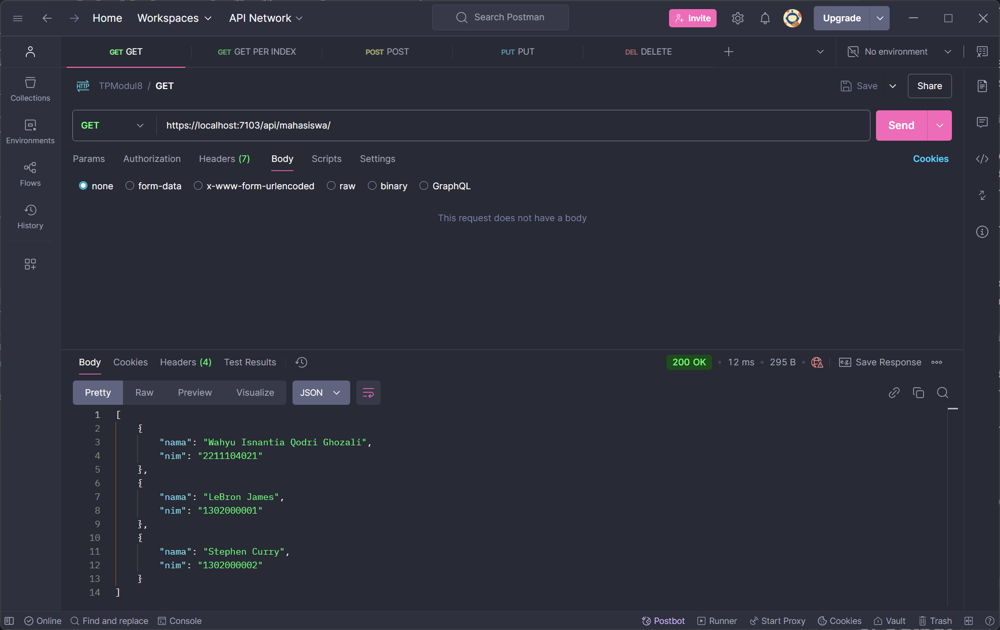

### POST (Menambah Data Mahasiswa)
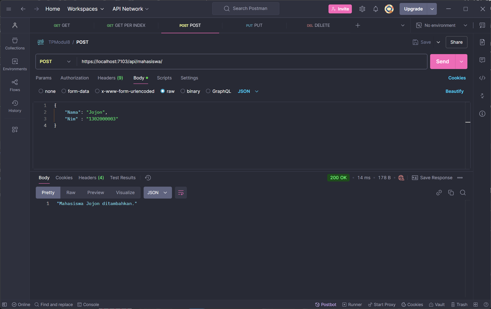
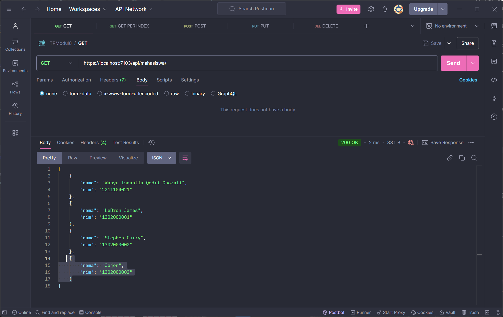

### PUT (Mengubah Data Mahasiswa)
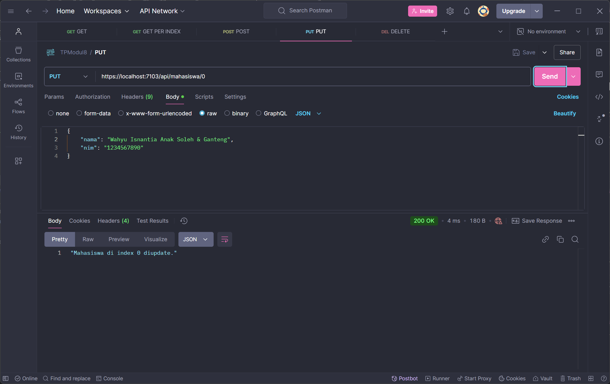
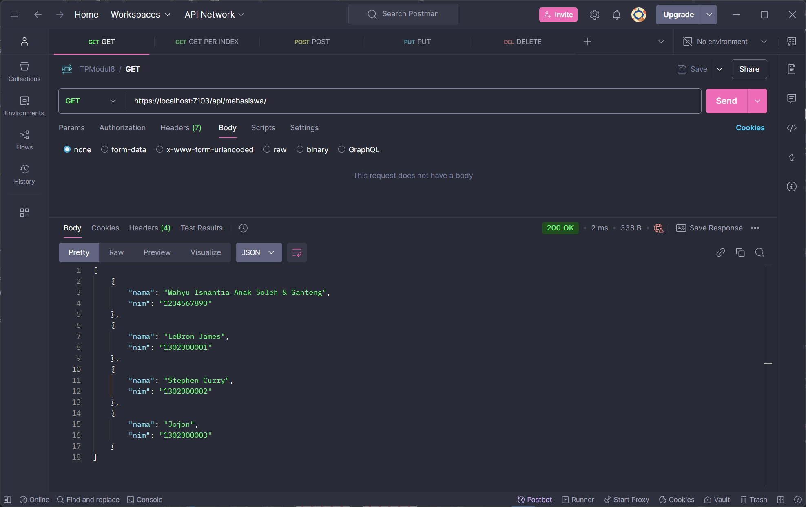

### DELETE (Menghapus Data Mahasiswa)
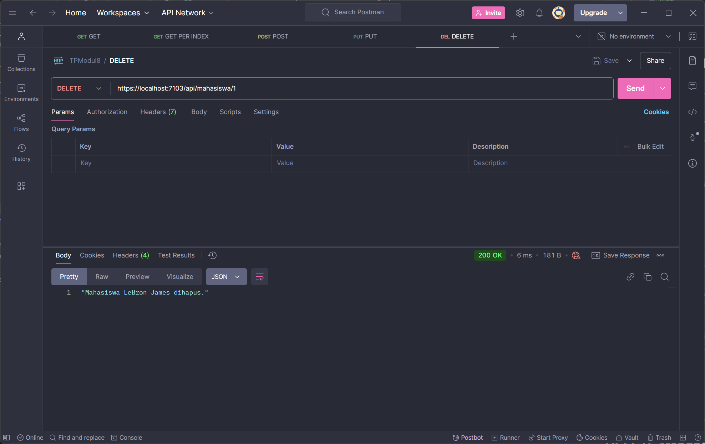
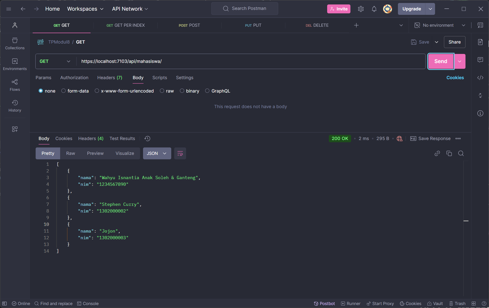
